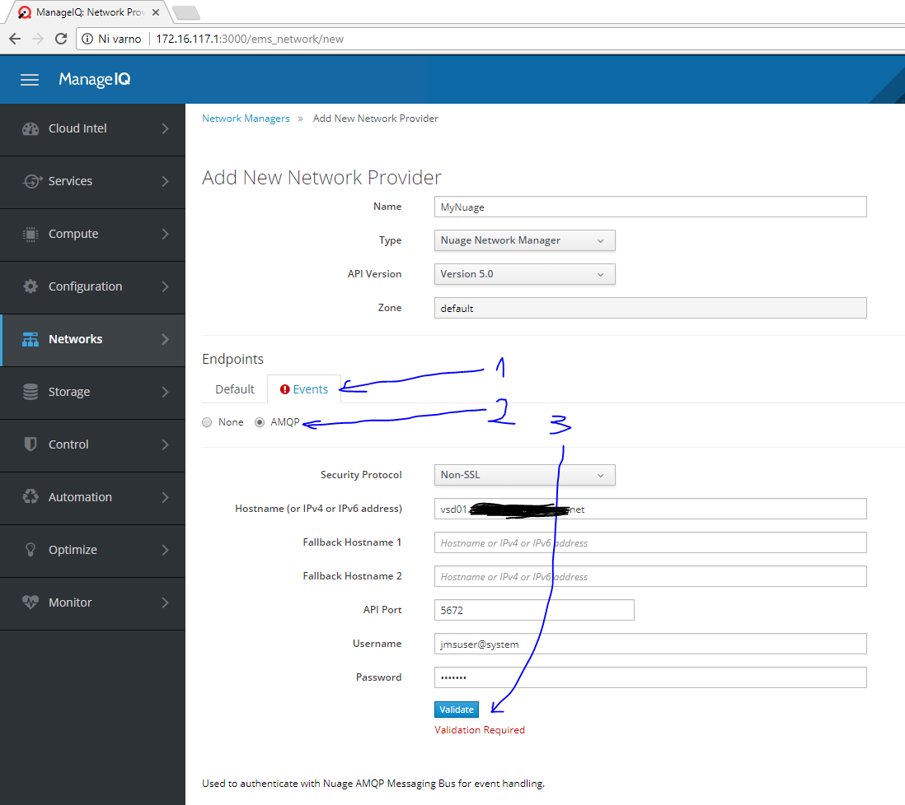

# Setup Guide for Ubuntu 16.04
This document describes steps needed to install and run MIQ appliance on a fresh Ubuntu 16.04 Desktop
VM. We've been using a 2 CPU / 8 GB RAM / 100 GB SSD virtual machine with bridged networking.

## Table of Contents
* [MIQ Installation - Prerequisites](#miq-installation-prerequisites)
* [MIQ Installation](#miq-installation)
* [Run MIQ](#run-miq)
* [Add Nuage Provider via GUI](#add-nuage-provider-via-gui)
* [Add Nuage Provider via Rails Console](#add-nuage-provider-via-rails-console)
* [Examine Nuage Provider via GUI](#examine-nuage-provider-via-gui)
* [Remove Nuage Provider via GUI](#remove-nuage-provider-via-gui)

## MIQ Installation - Prerequisites
Please follow [official installation guides](http://www.manageiq.org/docs/guides/developer_setup.html) to install
the neccessary system libraries for MIQ on Ubuntu, but here are the commands that we've used:

```bash
$ sudo apt-get update -y
$ sudo apt install -y git memcached postgresql libpq-dev bzip2 libffi-dev libreadline-dev libxml2-dev libxslt-dev \
   patch libsqlite-dev libsqlite3-dev npm g++ libcurl4-gnutls-dev cmake libgit2-dev \
   pkg-config libtool libssl-dev ruby
$ sudo systemctl enable memcached
$ sudo systemctl start memcached

# Node.js installation
$ sudo chown -R $USER ~/.npm
$ sudo chown -R $USER ~/.config
$ sudo npm install n -g && sudo n lts
$ sudo ln -s $(n bin lts) /usr/bin/node
$ sudo ln -s $(n bin lts) /usr/bin/nodejs

# Bower installation
$ sudo npm install yarn -g
$ sudo npm install bower -g

# Ruby installation
$ sudo apt-get install -y git-core curl zlib1g-dev build-essential libssl-dev libreadline-dev libyaml-dev \
   libsqlite3-dev sqlite3 libxml2-dev libxslt1-dev libcurl4-openssl-dev python-software-properties libffi-dev
$ git clone https://github.com/rbenv/rbenv.git ~/.rbenv
$ git clone https://github.com/rbenv/ruby-build.git ~/.rbenv/plugins/ruby-build
$ echo 'export PATH="$HOME/.rbenv/bin:$PATH"' >> ~/.bashrc
$ echo 'eval "$(rbenv init -)"' >> ~/.bashrc
$ source ~/.bashrc
$ CONFIGURE_OPTS=--enable-shared rbenv install 2.3.1 # CONFIGURE_OPTS is needed for Qpid-proton
$ rbenv global 2.3.1

# Qpid-proton installation (required by Nuage provider)
$ sudo apt-get install -y gcc cmake cmake-curses-gui uuid-dev libssl-dev libsasl2-2 libsasl2-dev swig
$ git clone --branch 0.19.0 https://github.com/apache/qpid-proton.git ~/qpid-proton
$ mkdir -p ~/qpid-proton/build && cd ~/qpid-proton/build
$ cmake .. -DCMAKE_INSTALL_PREFIX=/usr -DBUILD_BINDINGS=
$ make all
$ sudo make install

# Database installation
$ sudo grep -q '^local\s' /etc/postgresql/9.5/main/pg_hba.conf || \
   echo "local all all trust" | sudo tee -a /etc/postgresql/9.5/main/pg_hba.conf
$ sudo sed -i.bak 's/\(^local\s*\w*\s*\w*\s*\)\(peer$\)/\1trust/' /etc/postgresql/9.5/main/pg_hba.conf
$ sudo systemctl restart postgresql
$ sudo su postgres -c "psql -c \"CREATE ROLE root SUPERUSER LOGIN PASSWORD 'smartvm'\""
```

## MIQ Installation
Having the required system libraries installed, we then need to pull the MIQ source code from
[GitHub repository](https://github.com/manageiq/manageiq) and trigger the self-installation script
`bin/setup`:

```bash
$ git clone https://github.com/ManageIQ/manageiq.git ~/manageiq
$ #----------------------------- only needed temporarily until 0.19.0 support is upstreamed
$ cd ~/manageiq
$ git remote add patch https://github.com/miha-plesko/manageiq.git
$ git fetch patch
$ git checkout patch/upgrade-to-qpid-0.19.0
$ mkdir plugins && cd plugins
$ git clone --branch upgrade-to-qpid-0.19.0 https://github.com/miha-plesko/manageiq-providers-nuage.git
$ echo "override_gem 'manageiq-providers-nuage', :path => File.expand_path('~/manageiq/plugins/manageiq-providers-nuage')" > ../bundler.d/local_plugins.rb
$ #----------------------------- ENDOF only needed temporarily
$ cd ~/manageiq
$ export BUNDLE_WITH=qpid_proton
$ bin/setup # Qpid-proton is needed for Nuage provider's eventing
```

Viola! The MIQ is installed with all providers included (Nuage provider is enabled by default).

## Run MIQ
To run MIQ execute:

```bash
$ cd ~/manageiq
$ bundle exec rake evm:start
```

After some time (two, three minutes) the MIQ server will be up-and-running on port 3000. Access MIQ log with:

```bash
$ less ~/manageiq/log/evm.log
``` 

## Add Nuage Provider via GUI
Visit `http://{ubunutuVM-IP}:3000` in your favourite browser to access MIQ Dashboard. Login with `admin / smartvm`
and navigate to *Networks -> Providers* page using the main menu on the left:


Then select *Configuration -> Add a New Network Provider* using the menu in the center of the page:


Opt-in for "Nuage Network Manager" type and fill the form with your Nuage credentials. Press "Validate" when you're done:


A green popup saying "Credential validation was successful" will appear reporting that MIQ was able to connect to the Nuage server API.
But wait, **don't** click "Add" yet! There is another form to fill-in in order to turn eventing on. Go ahead, click "Events" tab and switch
from "None" to "AMQP" (AMQP stands for Advanced Message Queuing Protocol, and is used for continously capturing Nuage events, in case
you were wondering). Provide AMQP credentials in the form and click "Validate". The green popup should appear again.



That's it, confirm by pressing "Add" button in the bottom-right and Nuage provider will be added.
When added, the inventory will get collected automatically.

## Add Nuage Provider via Rails Console
It is also possible to register your Nuage provider from terminal i.e. without using the browser. Open a terminal
inside the VM where you're running MIQ and start interactive Rails console:

```bash
$ bundle exec rails console
```

Then register your Nuage like this:

```ruby
irb(main)> ems = ManageIQ::Providers::Nuage::NetworkManager.create(
  :name => 'MyNuage', 
  :hostname => 'vsd01.XYZ.net', 
  :port => '8443', 
  :security_protocol => 'ssl', 
  :api_version => 'v5.0', 
  :zone_id => MiqServer.my_server.zone.id
)
irb(main)> ems.authentications << AuthUseridPassword.create(:authtype => 'default', :userid => 'myuser', :password => 'mypass')
irb(main)> ems.authentications << AuthUseridPassword.create(:authtype => 'amqp', :userid => 'jmsuser@system', :password => 'mypass')
irb(main)> ems.endpoints       << Endpoint          .create(:role => 'amqp', :hostname => 'vsd01.XYZ.net', :port => '5672')
irb(main)> ems.authentication_check
irb(main)> ems.save
```

## Examine Nuage Provider via GUI
Navigate to *Networks -> Providers* and click on the Nuage Network Manager that you've created.


Provider overview will open:


At the moment there are two types of items in inventory - Cloud Subnets and Security Groups. Click on corresponding
row to get a list of items:


You can click on any particular Cloud Subnet to view even more details:


Exploring the rest of GUI should follow that same pattern. Happy browsing!

## Remove Nuage Provider via GUI
Open Provider's overview page and select *Configuration -> Remove this Network Provider from Inventory*
option in the mid-page menu. Provider will get deleted after a minute or two.


